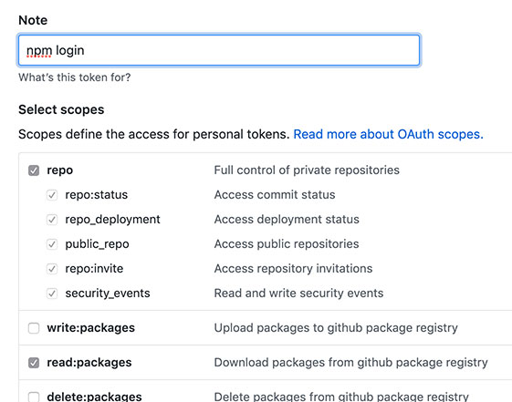

# Flare Static Site Generator starter

## Local environment

### Prerrequisites

- Node.js 12
- npm 6.14.1

#### Github token 

Your npm instanceneed to be logged in 

1. Make sure you have access with a Github account to the LKMX flare repository at https://github.com/lkmx/flare

2. Create a personal access token in your Github Account navigating to https://github.com/settings/tokens/new, making sure to select both **repo** and **read:packages**.



#### npm registry login

Login to the npm registry using your Github username and the token generated in the previous step as the password, running:

```
npm login --registry=https://npm.pkg.github.com
```

#### Dependencies and local server

Download the dependencies using

```
npm install
```

Run a live-reload local server running

```
gridsome develop
```

See the console for the local and network address to access the local server.
